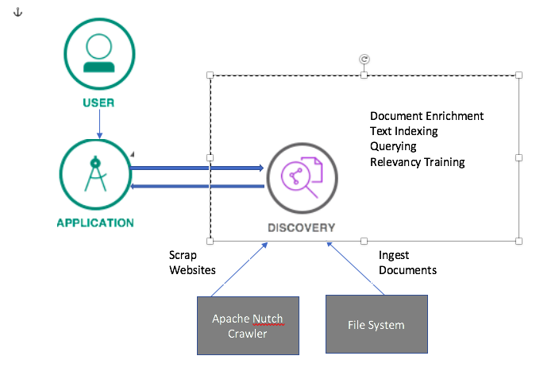
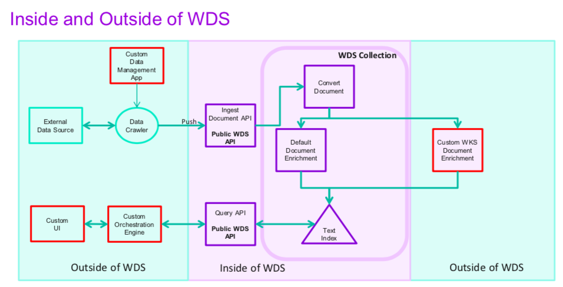
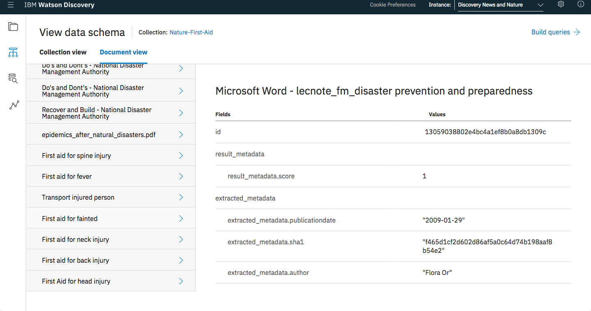
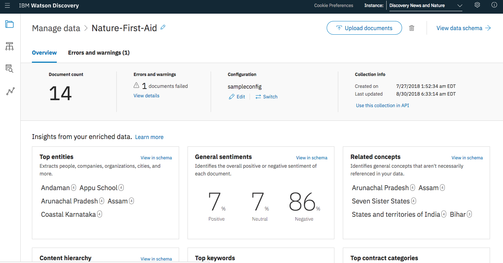
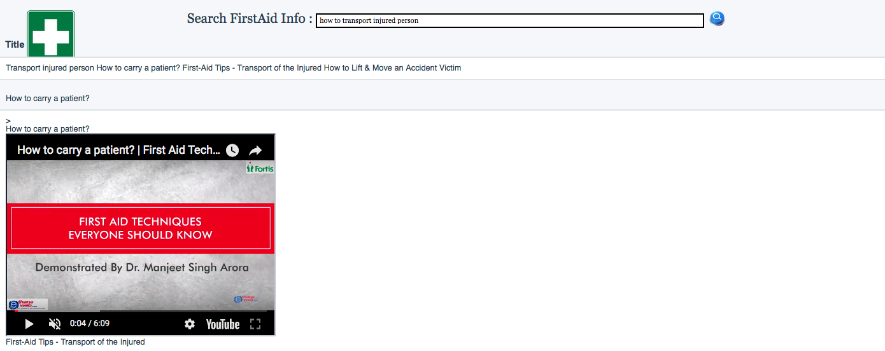

# cfc-first-aid

## Creating a smarter system with **Watson Discovery** to provide help on first aid information to bystanders or the NGO who have no medical or first responder skills.

The purpose for creating this application is most of the times the person who comes to rescue of injured person during natural calamities is bystander. He may be unaware of handling situations. If he/she mishandles injured person, there are chances of causing severe or life time damages to the injured person. So we are providing embedded videos to guide bystanders or NGO who is unaware of handling the situation. We are also providing info on do's and don'ts during natural calamities.

## The application is hosted at below URL

http://firstaid-fantastic-wombat.mybluemix.net/

## Architecture Diagram

## Process Flow

1. Create **Watson Discovery** instance.

2. Ingest Documents which has info on First Aid or preparedness. Refer disco-docs folder under project root folder for the sample documents ingested.

3. Scrap website which info on Do's and Don'ts using **Apache Nutch Crawler**. Refer https://github.com/IBM-Watson/nutch-indexer-discovery for crawling. We have referred National Disaster Management Authority website and National Civil Defense College website for do's and don'ts.

http://www.cddrm-ncdc.org/e39621/e39673/index_eng.html

https://ndma.gov.in/en/about-ndma/evolution-of-ndma.html

**We got website and also first aid clips info from Dr. Chetan, Civil Defense Department, Bangalore.**

4. Query the **Watson Discovery** to view the results.

5. Provide relevancy training feature of **Watson Discover** to improve the results.

## Create IBM Cloud services

Create the following services:

* [**Watson Discovery**](https://console.bluemix.net/catalog/services/discovery)

Once **Watson Discovery** service instance is created create collection and ingest documents. The following screen show documents ingested.

The enrichment details extracted from the document analysis

The user enters query and response is displayed in tool.

**The same response is shown in application. But in application you can view/watch the embedded videos.**

# Links
* [Watson Discovery](https://www.ibm.com/watson/services/discovery/)

# Learn more

* **Artificial Intelligence Code Patterns**: Enjoyed this Code Pattern? Check out our other [AI Code Patterns](https://developer.ibm.com/code/technologies/artificial-intelligence/).
* **AI and Data Code Pattern Playlist**: Bookmark our [playlist](https://www.youtube.com/playlist?list=PLzUbsvIyrNfknNewObx5N7uGZ5FKH0Fde) with all of our Code Pattern videos
* **With Watson**: Want to take your Watson app to the next level? Looking to utilize Watson Brand assets? [Join the With Watson program](https://www.ibm.com/watson/with-watson/) to leverage exclusive brand, marketing, and tech resources to amplify and accelerate your Watson embedded commercial solution.
